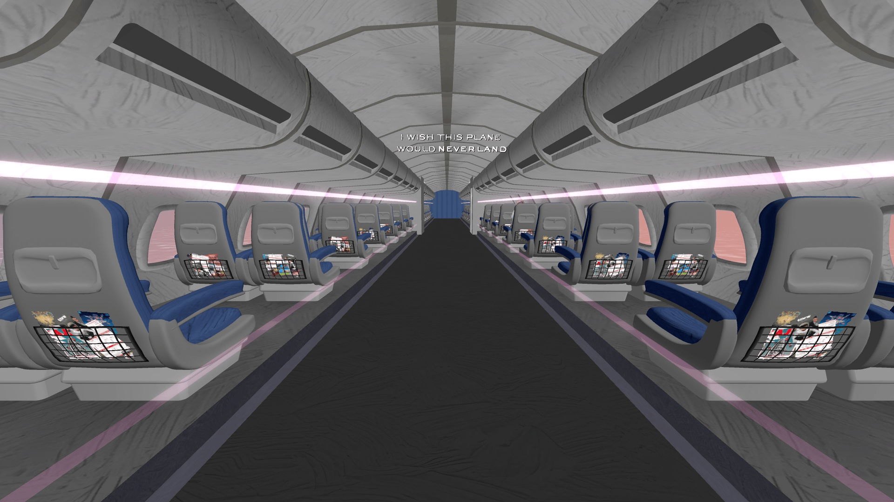

# The Plane That Never Lands - Vivify Beat Saber Custom Map

This is the repository for my custom Beat Saber map for "The Plane That Never Lands" by AJR, from their EP "What No One's Thinking". This map makes use of the Chroma, Noodle Extensions, and Vivify mods to create a fully custom environment.

BeatSaver link to map: [https://beatsaver.com/maps/52e2b](https://beatsaver.com/maps/52e2b)

The Expert-Easy mapping and Vivify environment are done by [me](https://github.com/Lekrkoekj), with the Expert+ mapping and lighting made by [steeak](https://beatsaver.com/profile/username/steeak).

Watch a gameplay preview of the map here (Expert+ difficulty): [https://youtu.be/3wk-QgWn_nI?feature=share](https://youtu.be/3wk-QgWn_nI?feature=share)

Watch a preview of the lightshow with the environment here: [https://youtu.be/WklhPUKRrjc?feature=share](https://youtu.be/WklhPUKRrjc)

This repository contains all the mapping files, ReMapper script, and full Unity project.

Assets from the following sources are included in this project:
- [VivifyTemplate by Swifter](https://github.com/Swifter1243/VivifyTemplate)
- [What No One's Thinking cover art](https://www.instagram.com/p/DL-kMWMpEsF/)
- [Bush models](https://www.fab.com/listings/56107089-69f1-4d88-b54a-9a75b1ec0964)
- [Rock models](https://www.fab.com/listings/055e31fb-d30e-44d8-aa4f-645206300887)
- [Tree models](https://sketchfab.com/3d-models/pine-tree-game-ready-dc3fbd9205cf4027a4455d1f415e0478)
- [City buildings](https://sketchfab.com/3d-models/full-gameready-city-buildings-0545317292c44490af5408cb58633121)
- [Front door](https://free3d.com/3d-model/custom-front-door-408633.html)
- [Car](https://www.fab.com/listings/eb8c8135-a5eb-46bb-9e28-d880bd503707)
- [City tree models](https://www.fab.com/listings/28820c60-aebe-441d-afbe-2113741b451c)
- [Airplane](https://sketchfab.com/3d-models/airbus-a340-300-2c6bc47ca51a4f8587845f6b1f08269b)